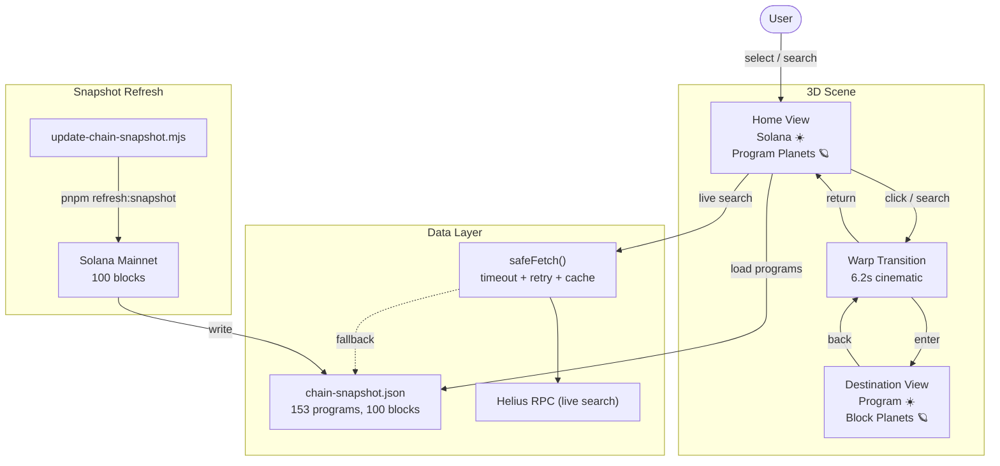

# Blockchain Galaxy

Blockchain Galaxy is a cinematic 3D Solana explorer built with Vite, React,
TypeScript, React Three Fiber, three.js, and GSAP.

The home view renders Solana as a central star and major on-chain programs as
orbiting planets. Selecting or searching a program triggers a warp transition
into that program's own system, where recent blocks orbit as planets sized by
activity.



## Features

- Solana ecosystem home view with popular programs as planets.
- Program autocomplete limited to the curated popular-program rollup.
- Safe Helius-powered live search with timeout, retry, and cached fallback.
- Program destination systems with block planets and an inspector HUD.
- Data-driven planet styles by category and program variant.
- Bloom, depth of field, vignette, starfield, orbit motion, and warp transition.

## Data

The app uses a committed Solana snapshot so the scene still works offline or
when RPC calls are rate-limited. Live program lookups use Helius when
`VITE_HELIUS_API_KEY` is available.

To refresh the cached snapshot locally:

```bash
pnpm refresh:snapshot
```

## Environment

Create a local `.env` file from `.env.example`:

```bash
HELIUS_API_KEY=
VITE_HELIUS_API_KEY=
```

`HELIUS_API_KEY` is used by the Node snapshot refresh script.
`VITE_HELIUS_API_KEY` is used by the browser for bounded live program searches.
Do not commit `.env`.

## Commands

```bash
# First-run local dev
pnpm install
pnpm up

# Normal development
pnpm dev

# Verify and build
pnpm check
pnpm build

# Production preview
pnpm demo
pnpm preview
```
